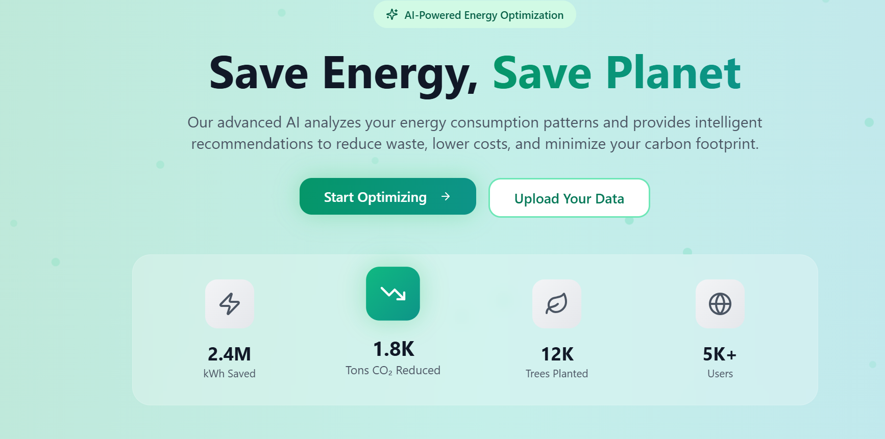
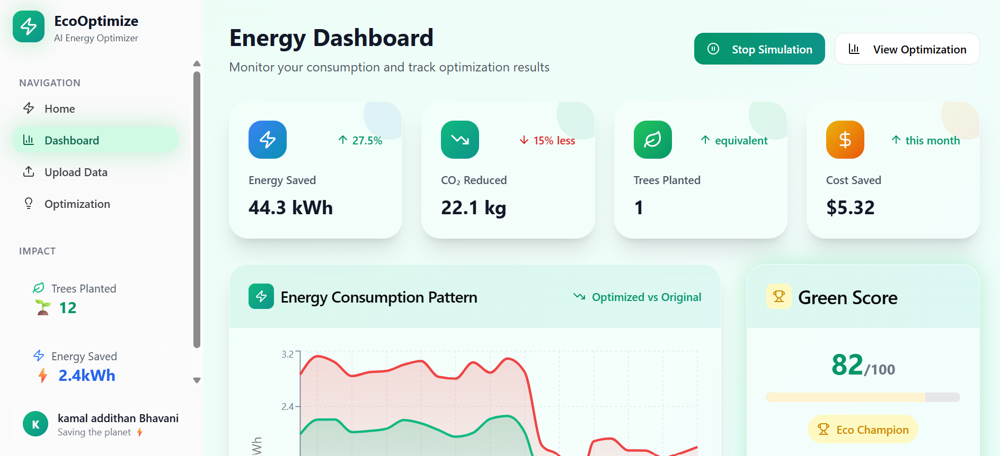
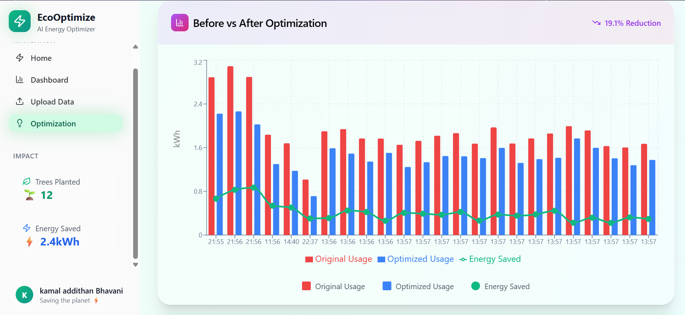
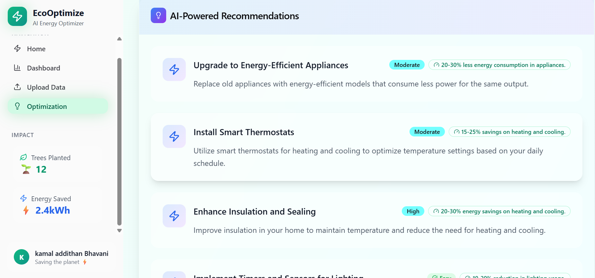

# ⚡ EcoWattAI – AI-Powered Energy Optimization Platform  

  
---

## 🌍 Introduction  

**EcoWattAI** is an AI-powered platform that helps households and organizations **reduce energy waste, lower electricity bills, and cut carbon emissions**.  
It acts as a **smart energy coach**, analyzing usage patterns, detecting inefficiencies, and providing actionable optimization suggestions.  

👉 *Because every watt saved is a step toward a cleaner future.*  

---

## 🚀 Key Features  

- **AI Analytics** → Detects energy usage patterns & inefficiencies.  
- **Smart Suggestions** → Personalized tips to cut waste (e.g., shift appliance usage to off-peak hours).  
- **Gamification** → Earn badges, track a “Green Score,” and see your CO₂ impact as *trees planted*.  
- **Real-Time Simulation** → Compare *Before vs After* optimization with live graphs.   
- **Impact Calculator** → Convert saved kWh into CO₂ avoided and cost savings.  

---

## 📊 How It Works  

1. **Upload Data** – Import CSV/Excel of energy usage.  
2. **Data Cleaning** – System normalizes and prepares your dataset.  
3. **ML Analysis** –  
   - Linear Regression → predicts future usage.  
   - K-Means Clustering → identifies peak hours.  
4. **Optimization Suggestions** – Actionable advice to reduce waste.  
5. **Impact Tracking** – View cost savings, CO₂ avoided, and trees planted.  

---

## 🛠️ Tech Stack  

### Frontend
- React.js  
- TailwindCSS (utility-first styling)  
- Framer Motion (animations)  
- Recharts (data visualization)  
- Lucide React (icons)  

### Backend
- FastAPI (Python web framework)  
- Scikit-learn (ML models: Linear Regression, K-Means)  
- Pandas & NumPy (data processing)  

### Development Tools
- Google Colab (model training)  
- Base44 (deployment hosting)  
- GitHub (version control)  

---

## 💻 Installation  

Clone the repository and run locally:  

# Clone repo
git clone https://github.com/<your-username>/Ecowatt-AI.git
cd Ecowatt-AI

# Frontend setup
cd frontend
npm install
npm start

# Backend setup
cd backend
pip install -r requirements.txt
uvicorn main:app --reload

## 📖 Usage  

1. Open the [Live Demo](https://eco-watt-ai-0df596b8.base44.app/Home).  
2. Upload your sample energy dataset (CSV/Excel).  
3. Click **Optimize** to generate suggestions.  
4. Explore:  
   - Before vs After graphs  
   - CO₂ savings → trees planted  
   - Chat with the Energy Assistant  

---

## 🤝 Contributing  

We welcome contributions!  

1. Fork the project  
2. Create your feature branch (`git checkout -b feature/amazing-feature`)  
3. Commit changes (`git commit -m 'Add amazing feature'`)  
4. Push to branch (`git push origin feature/amazing-feature`)  
5. Open a Pull Request  

---

## 📜 License  

Distributed under the **MIT License**. See `LICENSE` for details.  

---

## 👨‍💻 Credits 

- **Kamal Addithan S B** (Complete development)  

---

## 🌟 Acknowledgments  

- **SRM Institute of Science and Technology, Ramapuram**  
- **VIT Chennai – YUVA-AI-THON National Level Hackathon** (First Place 🏆)  

---
## 🔴 Live Demo Preview  

  
 
 
  

## 🔗 Live Demo  

👉 [Click here to try EcoWattAI](https://eco-watt-ai-0df596b8.base44.app/Home)  

